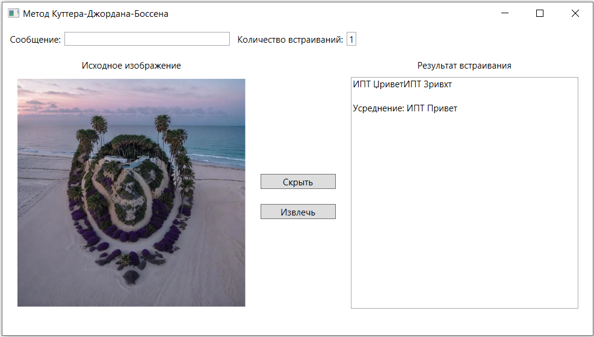

# Стеганографический метод Куттера-Джордана-Боссона
**NOTE**: [English version](README_EN.md)

Данное решение на C# реализует стеганографический метод Куттера-Джордана-Боссона (Метод "креста"), который применяется для встраивания информации в изображение.

# Описание метода
Данный метод использует свойство зрительной системы человека – слабая чувствительность к незначительному изменению яркости синего цвета.

В основе метода лежит модификации яркостей синего цвета отдельных пикселей.

## Встраивание
Пусть $m_i$ - отдельный бит встраиваемого в изображение *I = {R, G, B}* сообщения, где *R*, *G* и *B* - красная, зелёная и синяя компоненты пикселя соответственно, а *p = (x, y)* - псевдослучайная координата пикселя, в который будет производится встраивание.

Бит $m_i$ встраивается в канал синего цвета путем модификации яркости:

$$L_{x,y} = 0,29890R_{x,y} + 0,58662G_{x,y} + 0,11448B_{x,y}$$

Встраивание осуществляется побитно: один бит сообщения в одно значение яркости синего цвета $B_{x,y}$. При этом модифицированные значения $B^*_{x,y}$ яркости синего цвета вычисляются по формуле:

$$
B_{x,y}^*=
\begin{cases}
B_{x,y} + λL_{x,y}, & \quad \text{$m_{i}=1$}\\ 
B_{x,y} - λL_{x,y}, & \quad \text{$m_{i}=0$}
\end{cases}
$$

где λ - константа, определяющая «энергию» встраиваемого бита, то есть задает долю полноценной яркости, на которую и модифицируется канал синего цвета. Как правило, λ принимает значение 0,01...0,1. Чем больше λ, тем выше робастность (устойчивость) встраивания, но тем сильнее его заметность.

Координаты пикселей, использованные для встраивания, хранятся в секрете, т.е. задаются секретным ключом. Координаты могут быть выбраны произвольным образом с учетом области прогнозирования. Центры крестов не должны попадать в области прогнозирования других встраиваемых бит. В противном случае предсказанное значение может сильно отличаться от истинного, что даст ошибку извлечения.

## Извлечение
Извлечение получателем бита информации выполняется без наличия исходного изображения. Для того, чтобы восстановить исходный бит, нужно выполнить предсказание его значения.

Для реалистичных изображений всегда рядом стоящие пиксели имеют очень близкие значения яркостей, то есть изображение, как правило, сильно коррелировано (подобно). Это дает возможность вычислить некое предсказанное значение яркости синего цвета $\tilde B_{x,y}$.

То есть на приемной стороне уполномоченный пользователь, знающий координаты $x,y$, вычисляет предсказанное значение по правилу «креста».

$$\tilde B_{x,y} = \dfrac{\sum_{i=1}^σ( B_{x+i,y} + B_{x-i,y} + B_{x,y+i} + B_{x,y-i} )}{4σ} $$

где σ - количество пикселей сверху\снизу\слева\справа от оцениваемого пикселя.

Пример креста 5x5, σ = 2:

  

Извлечение бита осуществляется по правилу:

$$
m_{i}=
\begin{cases}
B_{x,y}^* > \tilde B_{x,y}, & \quad \text{$1$}\\ 
B_{x,y}^* < \tilde B_{x,y}, & \quad \text{$0$}
\end{cases}
$$

## Многократное встраивание
Для уменьшения вероятности ошибок извлечения в процессе встраивания каждый бит сообщения повторяется несколько раз (многократное встраивание). Поскольку при этом каждый бит был повторен *τ* раз, то получается *τ* оценок одного бита сообщения. Секретный бит извлекается по результатам усреднения разницы между реальным и оцененным значениями интенсивности пикселя в полученном контейнере:

$$ δ = τ^{-1} \sum_{i=1}^τ [B_{x,y}^* - \tilde B_{x,y}] $$ 

Тогда извлечение секретного бита описывается следующим образом:

$$
m_{i}=
\begin{cases}
δ > 0, & \quad \text{$1$}\\ 
δ < 0, & \quad \text{$0$}
\end{cases}
$$

# Источники
*  Метод Куттера-Джордана-Боссона (Метод «креста») /  [Электронный ресурс] // StudFiles : [сайт]. — URL: https://studfile.net/preview/7736499/page:8/ (дата обращения: 03.03.2024).
* Метод Куттера-Джордана-Боссена /  [Электронный ресурс] // Википедия : [сайт]. — URL: https://ru.wikipedia.org/wiki/%D0%9C%D0%B5%D1%82%D0%BE%D0%B4_%D0%9A%D1%83%D1%82%D1%82%D0%B5%D1%80%D0%B0-%D0%94%D0%B6%D0%BE%D1%80%D0%B4%D0%B0%D0%BD%D0%B0-%D0%91%D0%BE%D1%81%D1%81%D0%B5%D0%BD%D0%B0#:~:text=%D0%9C%D0%B5%D1%82%D0%BE%D0%B4%20%D0%9A%D1%83%D1%82%D1%82%D0%B5%D1%80%D0%B0%2D%D0%94%D0%B6%D0%BE%D1%80%D0%B4%D0%B0%D0%BD%D0%B0%2D%D0%91%D0%BE%D1%81%D1%81%D0%B5%D0%BD%D0%B0%20%2D,Imaging%20%D0%B2%20%D0%B0%D0%BF%D1%80%D0%B5%D0%BB%D0%B5%201998%20%D0%B3%D0%BE%D0%B4%D0%B0. (дата обращения: 03.03.2024).
*  Метод Куттера-Джордана-Боссена /  [Электронный ресурс] // StudFile : [сайт]. — URL: https://studfile.net/preview/7379018/page:33/ (дата обращения: 03.03.2024).